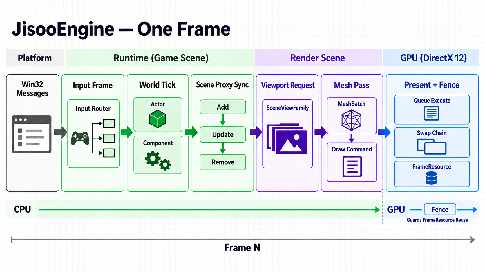

# JisooEngine

DirectX 12와 C++20으로 개발하는 Windows용 3D 게임 엔진입니다.  
엔진 구조와 렌더링 시스템을 직접 설계하고 구현하며, 각 계층의 책임과 생명주기를 명확하게 나누는 것을 목표로 합니다.

## Engine 흐름

JisooEngine의 한 프레임은 위 사진과 같이 플랫폼 입력을 게임 상태와 GPU 명령으로 단계적으로 변환합니다.  

## 문서

- [시작하기](docs/getting-started.md)
- [엔진 아키텍처](docs/architecture.md)
- [좌표계와 변환 규칙](docs/conventions/coordinate-system.md)
- [개발 계획](docs/development-plan.md)
- [테스트 검증 목록](docs/testing.md)
- [임시 구현 및 재검토 목록](docs/implementation-revisit-list.md)
